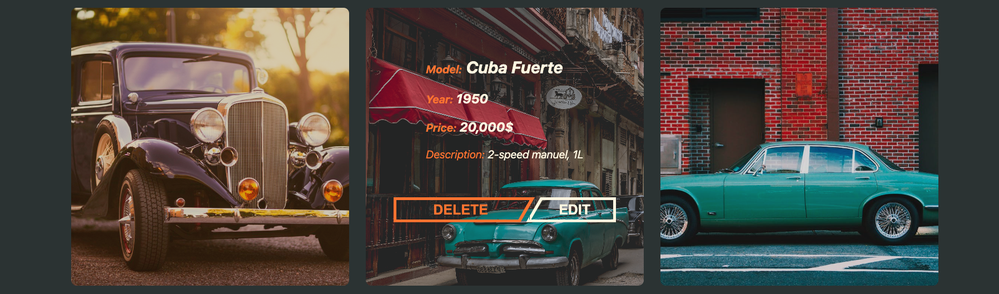
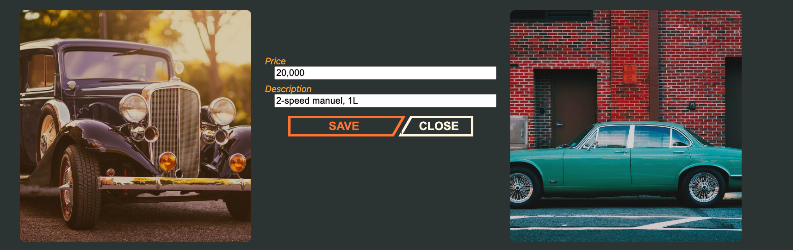
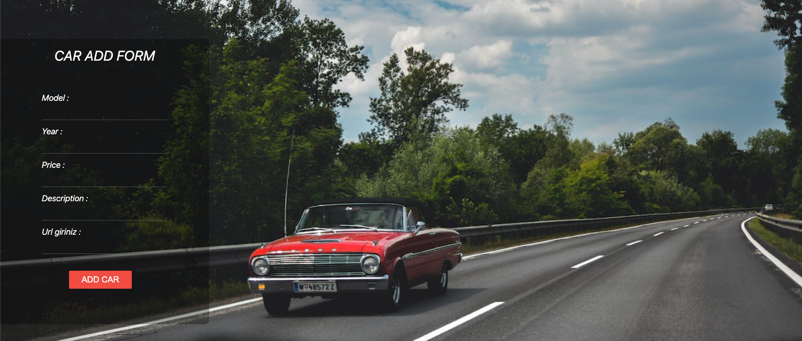

## Project : BUE CAR CLUB
### <ins>Visulation Of The Website<ins>
**Home Page**

**Card Back Side**

**Card Edit**

**Car Add**

#### Description
The main purpose of this project basically uses simple CRUD methods. In this project consisting of a single page, classic cars were displayed as cards.
#### Libraries used:
*-Axios*
*-Fontawesome*

#### Technologies and softwares used on this project:
*- HTML*
*- CSS*
*- REACT JS*
*- JS*

#### CREATED BY:
* <ins> [Berke Kazancı](https://www.linkedin.com/in/berkekazanc%C4%B1/)<ins>
* <ins> [Emre Şahbudak](https://www.linkedin.com/in/emre-%C5%9Fahbudak-a135a6169/) <ins>
* <ins> [Ünzile Medet](https://www.linkedin.com/in/%C3%BCnzile-medet-32028b192/) <ins>
